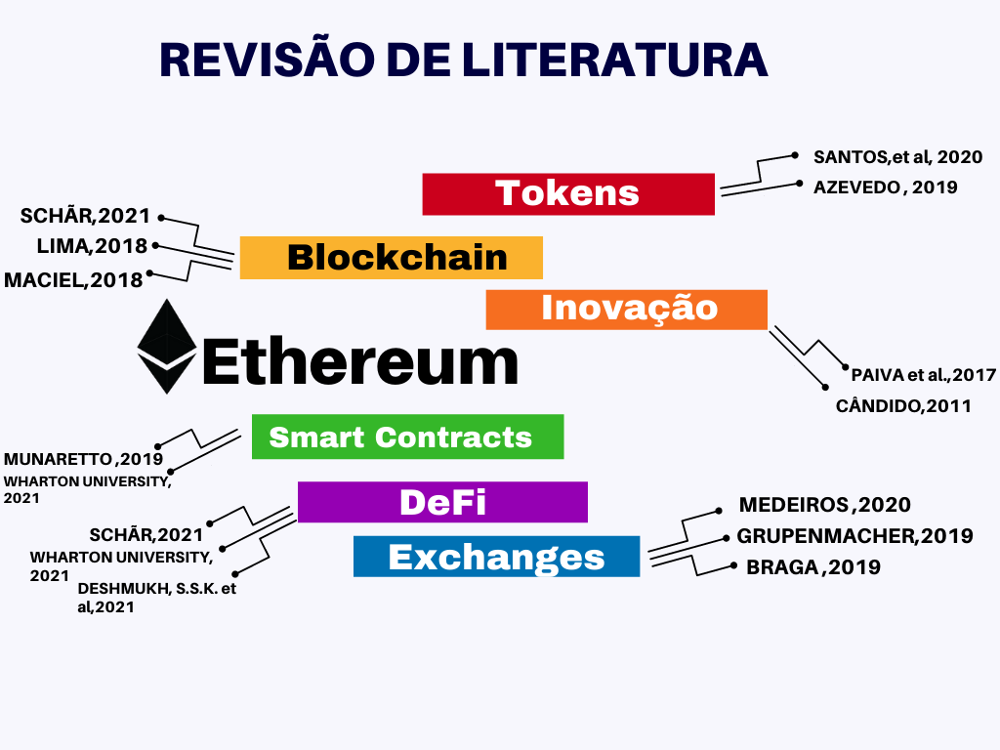

<p align="center">                        <!--largura--> <!--Altura-->
    
</p>
<p align="center">                        <!--largura--> <!--Altura-->
    
</p>
<p align="center">                        <!--largura--> <!--Altura-->
    
</p>
<p align="center">                        <!--largura--> <!--Altura-->
    
</p>
---
```{r echo=FALSE, fig.align='right', out.width="15%"}
knitr::include_graphics("img/logo.fw.png")

```

# Introdução

<p align="left">                        <!--largura--> <!--Altura-->
    
</p>
---
```{r echo=FALSE, fig.align='right', out.width="13%"}
knitr::include_graphics("img/logo.fw.png")

```

# Introdução
<p align="left">                        <!--largura--> <!--Altura-->
    
</p>
---
<p align="left">                        <!--largura--> <!--Altura-->
    
</p>


---
```{r echo=FALSE, fig.align='right', out.width="15%"}
knitr::include_graphics("img/logo.fw.png")

```
#	METODOLOGIA

<p align="right">                        <!--largura--> <!--Altura-->
    
</p>
[GIL, Carlos Antônio. Modos e técnicas de pesquisa social: 6° Edição. São Paulo: Editora Atlas s.a, 2008. ](https://ayanrafael.files.wordpress.com/2011/08/gil-a-c-mc3a9todos-e-tc3a9cnicas-de-pesquisa-social.pdf)
---
# RESULTADOS ESPERADOS
<p align="center">                        <!--largura--> <!--Altura-->
    
</p>
<p align="center">                        <!--largura--> <!--Altura-->
    
</p>

[Projeto TCC1](https://github.com/Lucas-Ed/Lucas-Ed-Projeto-tcc1-econ.github.io/blob/master/Lucas%20Eduardo%20Rosolem.pdf)
---
```{r echo=FALSE, fig.align='right', out.width="15%"}
knitr::include_graphics("img/logo.fw.png")

```
### Referências de literaturas que serão utilizadas

<p align="center">                        <!--largura--> <!--Altura-->
    
</p>
[AZEVEDO, 2019](https://bit.ly/3vPIb9U)

[BRAGA, 2019](https://bit.ly/35I710z)

[CÂNDIDO, 2011](https://bit.ly/3qnGiQv )

[DESHMUKH, 2021](https://bit.ly/35KTPbs)

[GRUMPENMACHER, 2019](https://bit.ly/3wSg6zX)

[LIMA, 2018](https://monografias.ufrn.br/jspui/bitstream/123456789/7328/1/A%20utiliza%c3
%a7%c3%a3o%20das%20criptomoedas_Lima_2018.pdf)

[MACIEL, 2018](https://bit.ly/3x2asv2)
---
```{r echo=FALSE, fig.align='right', out.width="15%"}
knitr::include_graphics("img/logo.fw.png")

```
<p align="center">                        <!--largura--> <!--Altura-->
    
</p>
[MEDEIROS, 2020](https://repositorio.animaeducacao.com.br
/bitstream/ANIMA/10956/1/TCC%20Gabriel%20Martins%20Medeiros%20-%20Vers%C3%A3o%20Final-2.pdf
)

[MUNARETTO, 2019](https://bit.ly/2TZxa8s)

[PAIVA, 2017](https://bit.ly/3vQJ6XF)

[SANTOS, et al, 2020](https://bit.ly/3xMNurN)

[SHCHÃR, 2021](https://files.stlouisfed.org/files/htdocs/publications/review/2021/04/15/decentralized-finance-on-blockchain-and-smart-contract-based-financial-markets.pdf)

[WHARTON UNIVERSITY, 2021](https://wifpr.wharton.upenn.edu/wp-content/uploads/2021/05/DeFi-Beyond-the-Hype.pdf)


---
```{r echo=FALSE, fig.align='right', out.width="15%"}
knitr::include_graphics("img/logo.fw.png")

```
#  Muito obrigado !
###-Meus contatos

[whatsapp](https://bit.ly/3uMmzeI)

[Telegram](https://bit.ly/2QjsTeT)

[Instagram](https://bit.ly/3ybr0Sj)

[Linkedin](https://bit.ly/2RU9X6B)

[Facebook](https://bit.ly/33L8m5P)

[Github](https://bit.ly/3ybqALJ)


---
```{r echo=FALSE, fig.align='right', out.width="15%"}
knitr::include_graphics("img/logo.fw.png")

```
### Tecnologias utilizadas para esta apresentação: 

<p align="center">
    
</p>


