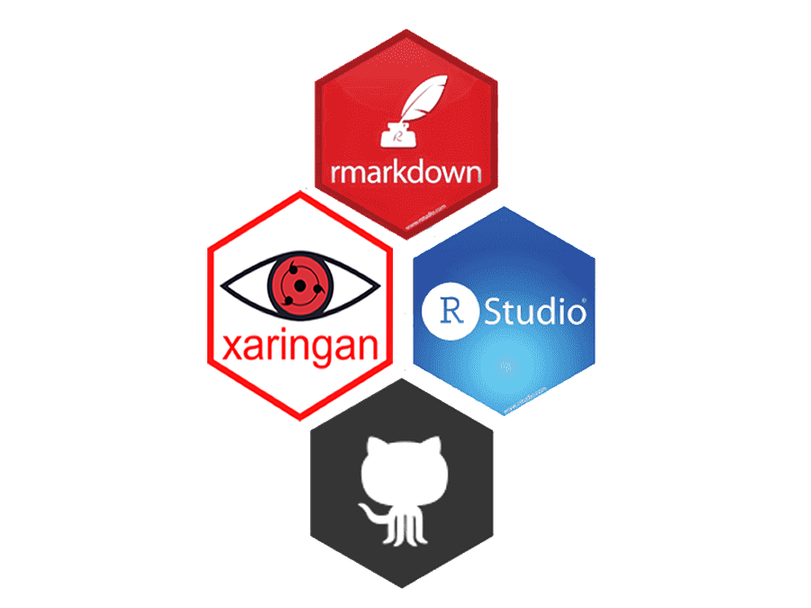

```{r echo=FALSE, fig.align='right', out.width="06%"}


```
# Resumo

 O projeto proposto por min vai investigar os conhecimentos do fenômeno da **“Tokenização”** de ativos que surgiu após o surgimento do **Bitcoin**, pautado com análise das pesquisas científicas publicadas sobre o tema; a pesquisa pretende abordar pontos chave sobre a situação de mercado que surgiu com essa tecnologia, explicar blockchain e outros conceitos importantes, pretendo fazer certas comparações com o mercado de ativos já estabelecido do ponto de vista legislativo e regulatório, e com a bolsa de valores, de pontos que afetam o investidor e impactam o mercado já estabelecido. Como essa tecnologia não impacta somente a bolsa de valores e também o mercado financeiro em geral, farei uma apresentação dos conceitos da tecnologia DeFi que surgiu pós surgimento da “Tokenização” e está rapidamente se formando um novo mercado financeiro em torno do fenômeno dos “tokens”. Objetivo da pesquisa é desbravar os pontos importantes desse fenômeno, e como esse novo sistema descentralizado impactam a economia, irei explicar se a hipótese de rompimento de paradigma atual, com essa digitalização de ativos com custódia ao portador. Considero a pesquisa importante pois, desde a criação do bitcoin uma imensa variedade de aplicações dessa idéia vem sendo desenvolvidas e utilizadas hoje em dia.
---
```{r echo=FALSE, fig.align='right', out.width="06%"}


```
#	METODOLOGIA

A **natureza** da pesquisa será um novo tipo de conhecimento aplicado, pois faz investigação no histórico recente sobre um fenômeno de mercado relativamente novo e em evolução, e traz exemplos da evolução em curso no mercado específico.
Para a realização, será feito uma pesquisa de literatura, investigativa e pesquisas, **explicativas, descritivas e documental**, de cunho qualitativo em torno da nova tecnologia.
Os materiais, buscados visará ter um modo de pesquisa sobre o tema  de cunho analítica também, pois levanta a partir de estudos feitos dar bases e dar suporte lógico e racional sobre o tema abordado e de fatos históricos recentes, que visam nos dar evidências suficientes para que possamos tirar conclusões  à questão de pesquisa que foi proposta, juntamente com os objetivos, foi considerado fatos de mercado e além disso será usado para enquadrar o fenômeno, alguns modus operandis, determinados em leis e pelo órgão regulador. Com o objetivo de explorar um tema que é uma questão no momento atual.
Para a pesquisa será feito buscas de palavras chaves sobre o tema, alguns exemplos que foram usados para a busca foram: criptomoedas e tokens/bitcoin/economia e criptomoedas etc.
Para a realização da pesquisa investigativa será levantando artigos e trabalhos acadêmicos sobre os assuntos da pesquisa, que foram buscados em Google acadêmico,**Biblioteca Eletrônica Científica Online Scientific Electronic Library**/Artigo institucional do **Banco central dos Estados Unidos** e do **Fórum econômico mundial** além da **legislação brasileira**.

---
```{r echo=FALSE, fig.align='right', out.width="06%"}


```
# Introdução

Logo após o evento da crise financeira  de 2008 um anônimo criou um sistema que visava substituir o sistema monetário atual, a partir disso mais no futuro houve o surgimento de sistemas alternativos ao que o anônimo criou, sistemas mais modernos e alternativos visam modificar o mercado de capitais, e não somente substituir o sistema monetário atual como propunha o anônimo, esse fenômeno podemos chamar de “Tokenização”, a pesquisa explorará o funcionamento desse sistema e como isso impacta os investimentos.
O **A pesquisa visa buscar o saber, sobre o estado atual dos conhecimentos e tecnologias deste fenômeno de surgimento de tokens que está ocorrendo após o surgimento do bitcoin**. 
**Objetivo** da pesquisa é desbravar os pontos importantes desse fenômeno, e como esse novo sistema descentralizado impactam o setor de investimentos, irei explicar se a **hipótese** levantada por min, do rompimento de paradigma atual no mercado de capitais, que está ocorrendo com essa digitalização de ativos com custódia ao portador, pode se consolidar no mercado. Considero a **pesquisa importante** pois, desde o surgimento do bitcoin uma imensa variedade de aplicações dessa idéia vem sendo desenvolvidas e utilizadas hoje em dia.

---
# REVISÃO DE LITERATURA
Alguns conceitos que serão revisados, são considerados por min chaves para entender o conceito da tokenização, isso trará maior clareza para entendermos todas as tecnologias necessárias para poder “operar” toda essa rede que tem por traz do ativo final que é o “token”.**A pesquisa explicará o conceito de propriedade/o que é token? /o que são smart contracts/Como operam as empresas do setor? / e por fim fara uma introdução em DeFi que é um mecanismo que surgiu após o fenômeno.**	
Abordarei questões legislativas do brasil e também do órgão regulador de valores mobiliários brasileiro a CVM. Depois se classificados todos os pontos importantes da pesquisa será feito uma conclusão sobre as hipóteses levantadas por min com base nos conceitos do conteúdo abordado.
<p align="center">
    
</p>

---
```{r echo=FALSE, fig.align='right', out.width="15%"}
knitr::include_graphics("img/liqi.png")

```
# Por que ?
#- Exemplos
<p align="center">
    
</p>
Um um dos clubes de futebol brasileiro tokenizou as remunerações de cada nova transferência de jogadores formados pelo próprio Clube e que já estão fora do clube a partir do Mecanismo de Solidariedade, pela startup brasileira Liqi.- Maiores informações sobre o ICO na [Liqi](https://liqi.com.br/)

---
```{r echo=FALSE, fig.align='right', out.width="8%"}
knitr::include_graphics("img/liqi.png")

```
# Direitos do token
O Cruzeiro Token representa uma fração dos direitos creditórios que participam do mecanismo de solidariedade, relacionados aos atletas que foram formados pelo clube. Ao adquirir o token, o detentor tem o direito de obter parte do valor que o clube formador receberá a cada nova transação de um  atleta para um novo clube após a primeira transferência, não envolvendo uma venda direta do jogador por parte do Clube.

<p align="center">
    
</p>

- Endereço do token na blockchain Ethereum

[0x56A147eA7eBA502380ECedDA905753AA041667EB](https://bscscan.com/token/0x56A147eA7eBA502380ECedDA905753AA041667EB)

---
```{r echo=FALSE, fig.align='right', out.width="06%"}


```

<p align="center">
    
</p>


---
<p align="center">
    
</p>
---
```{r echo=FALSE, fig.align='right', out.width="06%"}


```
<center>


</center>

---
```{r echo=FALSE, fig.align='right', out.width="06%"}


```
<center>

</center>
<!--<p align="center">
    
</p>
-->
---

# RESULTADOS ESPERADOS
Constatar se será possível haver rompimento de status quo com o fenômeno disruptivo explorado na pesquisa e tendências para o setor de mercado de capitais, e surgimento de novos mercados, com a inovação da tokenização de ativos.
Constatar também como o órgão regulador brasileiro de valores mobiliários está lidando com essa situação, para com proteção do investidor.

<p align="center">
    
</p>
---
```{r echo=FALSE, fig.align='right', out.width="06%"}


```
## Links úteis

[Pesquisa sobre token](https://www.researchgate.net/publication/342700981_Token_Economy_Uma_nova_maneira_de_investir)

[Cruzeiro token](https://www.liqi.com.br/tokens/cruzeiro-token-talentos-da-toca)

[Artigo Wharton University](https://wifpr.wharton.upenn.edu/wp-content/uploads/2021/05/DeFi-Beyond-the-Hype.pdf)

[Paper World Economic Fórum](http://www3.weforum.org/docs/WEF_DeFi_Policy_Maker_Toolkit_2021.pdf )

[Todos os Tokens padrão ERC20 que existem no Ethereum](https://etherscan.io/tokens)

[Compound Finance](https://compound.finance/)

[Dapp Compound Finance](https://app.compound.finance/)

[Uniswap](https://uniswap.org/)

[Dapp Uniswap](https://app.uniswap.org/#/swap)

[Hegic](https://www.hegic.co/)

[O Tamanho do Mercado de DeFi hoje](https://defipulse.com/)


---
#  Muito obrigado !
###-Meus contatos

[whatsapp](https://bit.ly/3uMmzeI)

[Telegram](https://bit.ly/2QjsTeT)

[Instagram](https://bit.ly/3ybr0Sj)

[Linkedin](https://bit.ly/2RU9X6B)

[Facebook](https://bit.ly/33L8m5P)

---

### Tecnologias utilizadas para esta apresentação: 

<p align="center">
    
</p>


